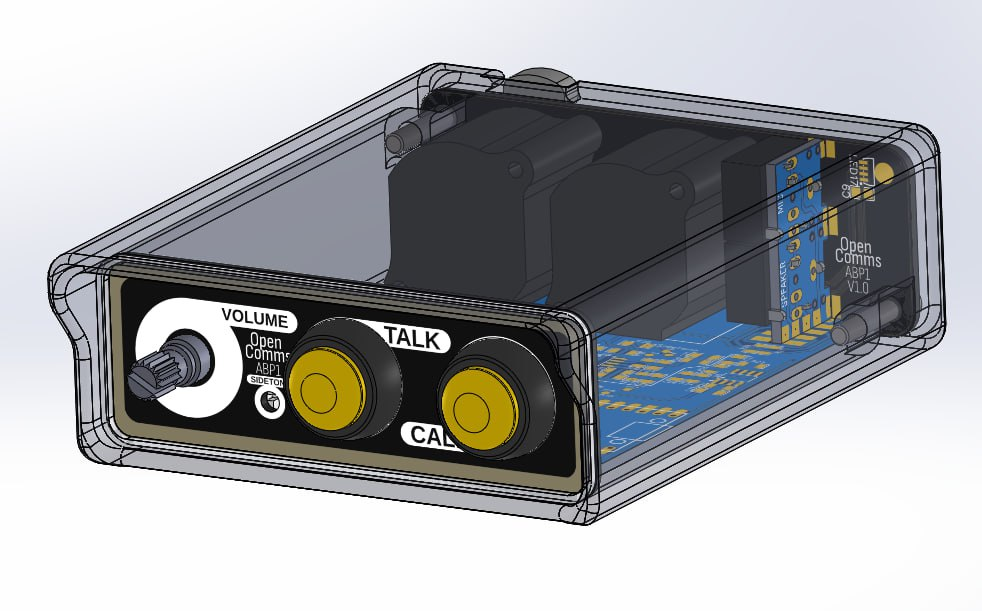

# ABP1 (Analog beltpack 1)

The ABP1 is a straightforward and reliable beltpack intercom for seamless communication. This beltpack uses the 2 wire partyline interface.

## Concept
The ABP1 was designed for simplicity. It provides users with a compact and lightweight device that seamlessly integrates into OpenComs partyline analog system. The ABP1 serves as a great starting point for anyone looking to build and/or extend their own analog beltpack for partyline intercom systems.

The idea was to create a "as simple as possible" starting point for future versions. For example instead of the typicall 4-pin XLR found on beltbacks for headsets, the APB1 uses two 3.5mm jacks. Here are some other differences:

The intercom is composed of:

 - One talk button
 - One call button
 - One volume knob
 - One sidetone adjustment potentiometer
 - One male and one female XLR for the partyline
 - Two 3.5mm jack (headphones + electret microphone)
 - 16 Leds for the front panel indicator

To facilitate the building process of this beltpack, it is composed of 4 individual PCBs:

  - Front panel
    - Holes for the buttons, volume and sidetone
    - 16 Side facing LEDs (WS2812B-**4020**)
    - Pads for a potentiometer placed up-side-down for the sidetone
  - Back panel
    - Holes for the 2 XLR connectors
    - Holes for the 2 3.5mm jacks
    - Holes for the two mounting screw
  - Back panel jack board
    - Simple board to hold the two jacks at a right angle

As the digital side fully control the talk, mute and call signals, this intercom also supports RMK (remote-mic-kill) provided that the off pulse is long enought to reset the microcontroller.

## PCB & Schematics
### Main PCB
 - Schematic: [[PDF]](electronics/main_pcb/SCH_OpenComs_ABP1_2023-05-12.pdf) [[EasyEDA]](electronics/main_pcb/SCH_EasyEDA_OpenComs_ABP1_2023-05-12.json) [[Altium]](electronics/main_pcb/SCH_AltiumExport_OpenComs_ABP1_2023-05-12.zip)
 - PCB: [[EasyEDA]](electronics/main_pcb/PCB_EasyEDA_OpenComs_ABP1_2023-05-12.json) [[Altium]](electronics/main_pcb/PCB_AltiumExport_OpenComs_ABP1_2023-05-12.pcbdoc) [[Gerber]](electronics/main_pcb/PCB_Gerber_PCB_OpenComs_ABP1.zip)
 - Bom: [[CSV]](electronics/main_pcb/BOM_OpenComs_ABP1_2023-05-12.csv)

### Front panel
 - Schematic: [[PDF]](electronics/front_panel/SCH_PDF_OpenComs_ABP1_Front-panel.pdf) [[EasyEDA]](electronics/front_panel/SCH_EasyEDA_OpenComs_ABP1_Front-panel_2023-05-12.json) [[Altium]](electronics/front_panel/SCH_Altium_OpenComs_ABP1_Front-panel_.schdoc)
 - PCB: [[EasyEDA]](electronics/front_panel/PCB_EasyEDA_OpenComs_ABP1_Front-panel_2023-05-12.json) [[Altium]](electronics/front_panel/PCB_Altium_OpenComs_ABP1_Front-panel_2023-05-12.pcbdoc) [[Gerber]](electronics/front_panel/PCB_Gerber_OpenComs_ABP1_Front-panel.zip)
 - Bom: [[CSV]](electronics/front_panel/BOM_OpenComs_ABP1_Front-panel_2023-05-12.csv)

### Back panel
 - Schematic: none
 - PCB: [[EasyEDA]](electronics/back_panel/PCB_EasyEDA_OpenComs_ABP1_Back-panel_2023-05-12.json) [[Altium]](electronics/back_panel/PCB_Altium_OpenComs_ABP1_Back-panel_2023-05-12.pcbdoc) [[Gerber]](electronics/back_panel/PCB_Gerber_OpenComs_ABP1_Back-panel_2023-05-12.zip)
 - Bom: none

### Back panel jacks
 - Schematic: [[PDF]](electronics/back_panel_jacks/SCH_PDF_OpenComs_ABP1_Back-panel_Jacks_2023-05-12.pdf) [[EasyEDA]](electronics/back_panel_jacks/SCH_EasyEDA_OpenComs_ABP1_Back-panel_Jacks_2023-05-12.json) [[Altium]](electronics/back_panel_jacks/SCH_Altium_OpenComs_ABP1_Back-panel_Jacks_Connectors_2023-05-12.schdoc)
 - PCB: [[EasyEDA]](electronics/back_panel_jacks/PCB_EasyEDA_OpenComs_ABP1_Back-panel_Jacks_2023-05-12.json) [[Altium]](electronics/back_panel_jacks/PCB_Altium_OpenComs_ABP1_Back-panel_Jacks_2023-05-12.pcbdoc) [[Gerber]](electronics/back_panel_jacks/PCB_Gerber_OpenComs_ABP1_Back-panel_Jacks_2023-05-12.zip)
 - Bom: [[CSV]](electronics/back_panel_jacks/BOM_OpenComs_ABP1_Back-panel_Jacks_2023-05-12.csv)

## 3D
Front:

Back:

*Note: These screenshot may not be fully up to date, especially the models of PCBs*

The 3D printed case is availible at: [[Solidworks source]](3d/case.sldprt) [[STL]](3d/case.stl) 

## Firmware 

The ABP1 digital side is based on the Atmega328p, the same as the arduino uno/nano/.... which makes it very easilly hackable to do what you want.<br>
The firmware can be found here:[https://github.com/OpenComs/device_abp1/tree/main/firmware](https://github.com/OpenComs/device_abp1/tree/main/firmware)

At the start you'll find some configuration values:
```cpp
#define CONF_CALL_BLINK_DURATION 1500
#define CONF_CALL_VIBRATE_AFTER 5000
#define CONF_CALL_BUZZ_AFTER 10000
#define CONF_TALK_LATCH_THRESHOLD 250
```

 - The `CONF_CALL_BLINK_DURATION` sets how long will the leds blink if a call is detected
 - The `CONF_CALL_VIBRATE_AFTER` sets how long a call signal need to be detected to enable the vibration motor
 - The `CONF_CALL_BUZZ_AFTER` sets how long a call signal need to be detected to enable the buzzer
 - The `CONF_TALK_LATCH_THRESHOLD` set the maximum time the talk button should pressed to latch the state change instead of the tremporary change

## Cost

The overall cost of this device is pretty low, especially if you build multiple of them.

Here is an approximation of the cost to build 5 beltpacks:

| What | Bought were | Cost |  Quantity | Comment |
|------|-------------|------|-----------|---------|
| Main PCB | JLCPCB | 2.22eur | 5 |  |
| Main PCB assembly | JLCPCB | 34.97eur | 5 | Economic PCBA, most of the components |
| Front panel | JLCPCB | 5.08eur | 5 | Black PCB with white silkscreen |
| Back panel | JLCPCB | 5.08eur | 5 | Black PCB with white silkscreen |
| Back panel jacks | JLCPCB | 3.62eur | 5 |  |
| [NC3MAAH (Male XLR)](https://fr.farnell.com/neutrik/nc3maah/plug-xlr-pcb-horizontal-3pole/dp/1310044) | Farnell | 8.28eur | 5 |  |
| [NC3FAAH1 (Female XLR)](https://fr.farnell.com/neutrik/nc3faah1/socket-xlr-pcb-horizontal-3pole/dp/1310019) | Farnell | 7.74eur | 5 |  |
| [Red button (12mm)](https://aliexpress.com/item/1005003302861259.html) | Aliexpress | 2.88eur | 5 |  |
| [Green button (12mm)](https://aliexpress.com/item/1005003302861259.html) | Aliexpress | 2.88eur | 5 |  |
| [PJ307 3.5mm jack](https://aliexpress.com/item/1005005130412879.html) | Aliexpress | 1.59eur | 10 |  |
| [WS2812B-4020](https://aliexpress.com/item/1005003999865721.html) | Aliexpress | 11.47eur | 100 | MOQ is 100 only 16 needed by intercom |
| [PTD902-2015F-A103](https://fr.farnell.com/bourns/ptd902-2015f-a103/potentiometre-audio-10k-20-0-025w/dp/2396034) | Farnell | 15.54eur | 5 | Any 5k to 10k **log** potentiometer is fine |
| [5k trimpot](https://aliexpress.com/item/33050960926.html) | Aliexpress | 2.56eur | 100 | MOQ is 100 only 5 needed |

Without 3D printer filament and other tools nesseary to build these the raw cost of the components for 5 beltpacks amount to arround `104eur` with is arround `21eur` per intercom.

*Note that some of the part here can be salvaged or found for way cheaper, which will bring the cost down even more*